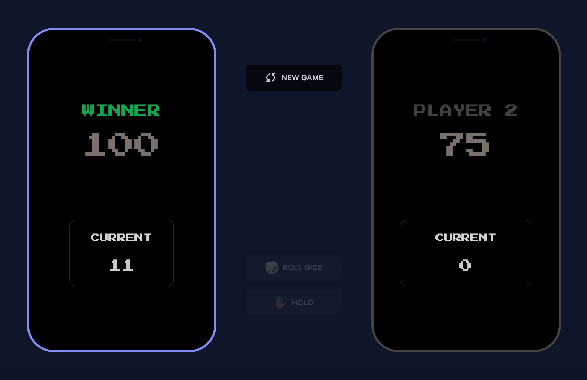

# Pig Game

### Work in progress...👩🏾‍💻

#### Inspired by Jonas Schmedtmann's vanilla JavaScript <a href="https://pig-game-v2.netlify.app/">Pig Game</a>



## Topics of Exploration:

1. React
2. Redux Toolkit
3. daisyUI

## Instructions To Start App:

1. Fork Pig Game repo
2. Git clone forked copy to local environment and open in IDE/code editor
3. Open a new terminal in IDE/code editor
4. Install dependencies:

```
   npm i
```

5. Start App

```
  npm run dev
```
